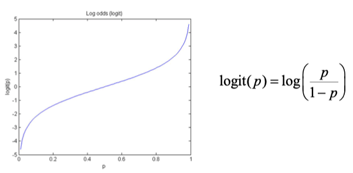
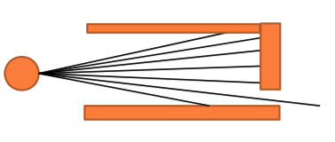
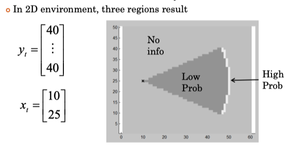
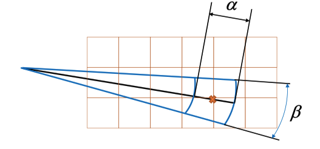
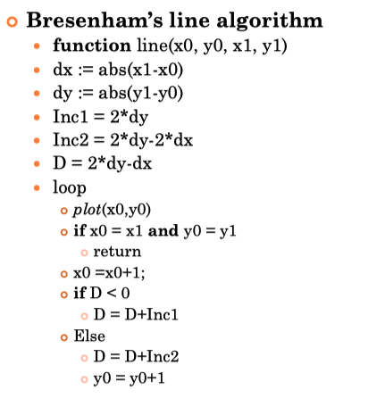
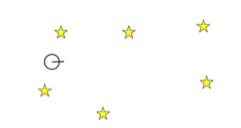
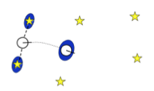
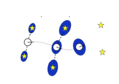
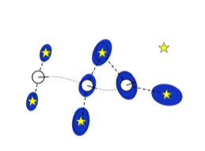
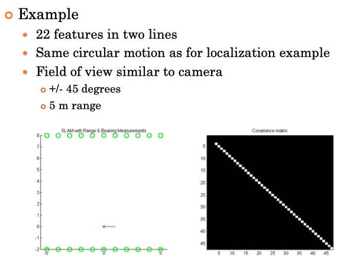

# 3. Localization and Mapping + SLAM

## Table of Contents

[TOC]

---

## Localization

### Formulation

- Localization:
  - using sensor info. to locate the vehicle in a known environment
- Formulation:
  - Given:
    - Control inputs and motion model
    - Sensor measurements and measurement model relative to environment 
    - Environment model
  - Find:
    - Vehicle position
  - Problems:
    - I.C.
      - Local: Known initial position
        - Tracking position through motions with inputs and measurements
      - Global: Unknown initial positions
        - Finding position and then continuing to track
      - Kidnapped: Incorrect initial position
        - Correcting incorrect prior beliefs to recover true position and motion
  - Assumptions:
    - Known static env. 
      - No moving obstacles, or other vehicles that cannot be removed from sensor measurements
    - Passive Estimation
      - Control law does not seek to minimize estimation error
    - Single Vehicle:
      - Only one measurement location is available

### Feature-based Localization

- Feature-based localization

  - Most natural formulation of localization problem

    - Sensor measure bearing, range, relative position of features
    - Location based maps can be reduced to a set of measurable features
    - The more features tracked the better the solution
      - But the larger the matrix inverse at each timestep

- **Ex: Two-wheeled robot**

  - 

  - **Vehicle State, Inputs:**
    $$
    \begin{bmatrix}
    x_1 \\ x_2 \\ x_3
    \end{bmatrix} 
    = 
    \begin{bmatrix}
    x \\ y \\ \theta
    \end{bmatrix} 
    
    \quad
    \begin{bmatrix}
    u_1 \\ u_2
    \end{bmatrix} = 
    \begin{bmatrix}
    v \\ \omega
    \end{bmatrix}
    $$

  - **Motion Model:**
    $$
    \begin{bmatrix}
    x_{1,t} \\ x_{2,t} \\ x_{3,t} 
    \end{bmatrix} 
    = g(x_{t-1}, u_t) = 
    \begin{bmatrix}
    x_{1,t} + u_{1,t} \cos{x_{3, t-1} dt} \\ x_{2,t} + u_{1,t} \sin{x_{3, t-1} dt} \\ x_{3,t} + u_{2, t} dt
    \end{bmatrix}
    $$

  - **Feature Map:**
    $$
    m = \{m^1, ..., m^M\}. m^i = \{m^i_x, m^i_y\}
    $$

    - Assume all features are uniquely identifiable

    - **Measurement Model:**
    
    - Relative range and/or bearing to closest feature $m^i$, regardless of heading
    
    - Assume measurement of closest feature only
      $$
      \begin{bmatrix} y_{1,t} \\ y_{2,t}\end{bmatrix} = h(x_t) = \begin{bmatrix} \tan^{-1}{\frac{m^i_y - x_{2,t}}{m^i_x-x_{1,t}}} - x_{3,t} \\ \sqrt{(m_x^i - x_{1,t})^2 + (m^i_y - x_{2,t})^2}\end{bmatrix} \quad \begin{matrix} \leftarrow \text{Bearing} \\\\ \leftarrow \text{Range}\end{matrix}
      $$
      
    
  - 

  - **Two Approaches:**

    - 1) **EKF (UKF)** based localization:**
      - Fast computationally
      - Intuitive forumlation
      - Most frequently implemented
      - Possibility for **divergence** if nonlinearities are severe
      - Additive Gaussian noise:
        - $\epsilon_t \sim \mathcal{N}(\mu=0,\,\sigma^{2}=R_t) $  and $\delta_t \sim \mathcal{N}(\mu=0,\,\sigma^{2}=Q_t) $
    - 2) **Particle** Filter based localization:
      - Slightly cooler visualizations
      - More expensive computationally
      - More capable of handling extreme nonlinearities, constraints, discontinuities

  - **EKF**:

    - Recall:

      - Prediction Update:

      $$
      \begin{align}
      G_t &= \left. \frac{\partial}{\partial x_{t-1}} g(x_{t-1}, u_t) \right|_{x_{t-1}=\mu_{t-1}} \\
      \bar{\mu}_t &= g(\mu_{t-1}, u_t) \\ 
      \bar{\Sigma}_t &= G_t \Sigma_{t-1} G_t^T + R_t
      \end{align}
      $$

      - Measurement Update:

      $$
      \begin{align}
      H_t &= \left. \frac{\partial}{\partial x_t} h(x_t) \right|_{x_{t}=\mu_{t}} \\
      K_t &= \bar{\Sigma}_t H_t^T (H_t \bar{\Sigma}_t H_t^T + Q_t)^{-1}\\
      \mu_t &= \bar{\mu}_t  + K_t (y_t - h(\bar{\mu}_t))\\ 
      \Sigma_t &=  (1 - K_t H_t)\bar{\Sigma}_{t-1}
      \end{align}
      $$

    - Linearization of Motion Model:
      $$
      \begin{bmatrix}
      x_{1,t} \\ x_{2,t} \\ x_{3,t} 
      \end{bmatrix} 
      = g(x_{t-1}, u_t) = 
      \begin{bmatrix}
      x_{1,t} + u_{1,t} \cos{x_{3, t-1} dt} \\ x_{2,t} + u_{1,t} \sin{x_{3, t-1} dt} \\ x_{3,t} + u_{2, t} dt
      \end{bmatrix}
      $$

      - => 
        $$
        \frac{\partial}{\partial x_{t-1}} g(x_{t-1}, u_t) =\begin{bmatrix}
        1 & 0 & -u_{1,t} \cos{x_{3, t-1} dt} \\ 0 & 1 & u_{1,t} \sin{x_{3, t-1} dt} \\ 0 & 0 & 1
        \end{bmatrix}
        $$

    - Linearization of Measurement Model:
      $$
      \begin{bmatrix} y_{1,t} \\ y_{2,t}\end{bmatrix} = h(x_t) = \begin{bmatrix} \tan^{-1}{
      \left(\frac{m^i_y - x_{2,t}}{m^i_x-x_{1,t}}\right)} - x_{3,t} \\ \sqrt{(m_x^i - x_{1,t})^2 + (m^i_y - x_{2,t})^2}\end{bmatrix} \quad \begin{matrix} \leftarrow \text{Bearing} \\\\ \leftarrow \text{Range}\end{matrix}
      $$

      - => 
        $$
        \frac{\partial}{\partial x_t} h(x_t) = 
            \begin{bmatrix} 
            \frac{(m^i_y - x_{2,t})}{q} & - \frac{(m_x^i - x_{1,t})}{q} & -1 \\
            -\frac{(m^i_x - x_{1,t})}{\sqrt{q}} & - \frac{(m_y^i - x_{2,t})}{\sqrt{q}} & 0 \\
            \end{bmatrix}
        $$
        

        ​	  Where: $q = (m_x^i - x_{1,t})^2 + (m^i_y - x_{2,t})^2$
        ​      

- **SIMULATION RESULT:**

  - Five features in a 2D world
    
  - No confusion over which is which with correct correspondence
    
  - Two wheeled robot $(x,y,\theta)$
    
  - Measurement to feature of Range, Bearing, both
    
    
    
  - **Findings:**
    
        - Moderate noise:
          - both measurements noisy, correct prior, large distubances
        - Range only:
          - Elongate covariance erro elipse
          - 
        - Bearing only:
          - No idea how deep we are
        - Bearing only, incorrect prior (Kidnapped):
          - till first feature, it correct the path
          - incorrect heading but consistent pathing

---

## Mapping

- Types: 

  - **Location based: Occupancy Grid**

    
    $$
    m=
    \begin{bmatrix} 
    m^1 & \dots & m^N \\
    \vdots  & \ddots & \vdots \\
    m^{M-N + 1} & \dots & m^M
    \end{bmatrix}
    $$

    - Can be probablisitic in formulation with $m^i \in [0, 1]$
    - Scales poorly, but works well in 2D (Plannar Position)

  - **Feature based: Set of all features**

    - A feature is defined at a specific location, and may have a signature: $m^i = \{ x^i , y^i, s^i\}$

    $$
    M_n = \{ m^1, \dots, m^M \}
    $$

    

    - Effective for localization
    - Scales well to larger dimensions
    - Hard to use for collision avoidance

### Formulation

- Mapping:
  - Using sensor införmation known vehicle locations to define a map of the env.
- Given:
  - Vehicle location model
  - Sensor measurements and ==inverse measurement model==
- Find:
  - Environment Map

### Occupancy Grid Mapping

- Find probability at time $t$ that each grid cell contains an obracle

  - $bel_t(m^i) = p(m^i | y_{1:t}, x_{1:t})$

  - Subscript $t$ moved to emphasize that features are **static**

- **Assumptions:**

  - Static env.
  - Independence of cells
  - Known vehicle state at each time step
  - Sensor model is known

- [ Recall Discrete **Bayes Filter Algorithm** ]

  - Prediction update (Discrete Total probability)

    - $\bar{bel}(x_t) = \sum{p(x_t | u_t, x_{t-1}) \, bel(x_{t-1})}$

  - Measurement udpate (Bayes Theorem)

    - $bel(x_t) = \eta \, p(y_t|x_t) \, \bar{bel}(x_t)$

    - $\eta$ is a normalizing constant that does not depend on the state (will become apparent in derivation)

- => **Bayes  Filter** with **static** states

  - Since the cell contents do not move, the motion model is trivial
    - The predicted belief is simply the belief from the previous time step
      - $\bar{bel}_t(m) = bel_{t-1}(m)$
    - The prediction step is no longer needed, so we update with each new measurement regardless of vehilce motion
      - $bel_t(m) = \eta \, p(y_t|m) \, \bar{bel}_{t-1}(m) $

- **Log Odds Raio** ($\equiv$ **Logistic Regression** $\equiv$ **Logit Function**)

  - For easy computation (!= 0)
  - Instead of tracking the probability, we track the log odds ratio for each cell
  - 
  - $logit(p) = log(\frac{p}{1-p})$
  - We get simple addition instead of multiplication, but downside: we need to recompute models in logit space

- **=> Bayesion Log Odds Update**  

  - Derivation:
    - For each cell, we have a measurement update (with the normalizer defined explicitly)
      - $p(m^i|y_{1:t}) = \frac{p(y_t|y_{1:t-1}, m^i) p(m^i|y_{1:t-1})}{p(y_t| y_{1:t-1})}$
    - We still trust in the Markov assumption:
      - $p(m^i|y_{1:t}) = \frac{p(y_t|m^i) p(m^i|y_{1:t-1})}{p(y_t| y_{1:t-1})}$
    - apply Bayes rule to measurement model:
      - $p(y_t | m^i) = \frac{p(m^i | y_t)\, p(y_t)}{p(m^i)}$
    - .... [Look at slides]
  - Shorhand of update rule:
    - $l_{t, i} = logit(p(m^i|y_t)) + l_{t-1, i} - l_{0, i}$
    - The log odd ratio at t is the sum of the ratio at $t-1$ $+$ the inverse measurement ratio $-$the initial belief
    - To get the inverse measurement ratio, we need an inverse measurement model
      - Probability of a state given a certain measurement occurs
        - $p(m^i | y_t)$
      - Inverse conditional probability of the measurement models used to date
        - $p(y_t | m^i)$

- **Examples: Laser Scanner**

  - 

  - Returns a range to the closest objects at a set of bearings relative to the vehicle heading

    - Scanner Bearings
      - $\phi^s = [-\phi^s_{max} \,\dots \,\phi^s_{max}] \qquad \phi^s_j \in \phi^s$
    - Scanner Ranges
      - $r^s = [-r^s_1 \,\dots \,r^s_J] \qquad r^s_j \in [0, r^s_{max}]$

  - **Inverse measurement model**

    - 

    - Define relative range and bearing to each cell

      - $$
        \begin{bmatrix}\phi^i \\ r^i\end{bmatrix}=\begin{bmatrix} \tan^{-1}{
        \left(\frac{m^i_y - x_{2,t}}{m^i_x-x_{1,t}}\right)} - x_{3,t} \\ \sqrt{(m_x^i - x_{1,t})^2 + (m^i_y - x_{2,t})^2}\end{bmatrix}
        $$

    - Find relevant range measurement for that cell

      - Closest bearing of a measurement
        - $k = argmin(|\phi^i - phi^s_j|)$

    - Identify each of the three regions and assign correct probability of object

      - if $r^i > \min(r_{max}^s, r_k^s)$ or $|\phi^i - \phi_k^s| > \beta /2$
        - $\Rightarrow$ then no info.
      - else if $r^s_k < r^s_{max}$ and $|r^i - r^s_k| < \alpha /2$
        - $\Rightarrow$ then high probability of an object
      - else if $r^i < r^s_k$
        - $\Rightarrow$ then low probability of an object

    - $\alpha$ and $\beta$ defines the extent of the region to be updated:

      - 

- **Example: Simple Motion**

   

- **Bresenham's line algorithm**

  - Instead of updating each cell once for a complete scan
  - Perform one udpate per range measurement
  - Converted ray tracing into integer math update
  - **==[ See details in Slides ]==**

- Mapping: **Computation issues**
  - Grid size
    - Calculation grows as resolution of grid increases
    - Topological approximations possible
  - Measurement model pre-caching
    - Model does depend on state, but does not change, so entire model can be pre-calculated
  - Sensor subsampling
    - Not all measurements need be applied, may be significant overlap in scans
  - Selective updating
    - Only update cells for which significant new information is available

---

## SLAM : Simultaneous Localization And Mapping

### Formulation

- Given: 
  - Motion model
  - Measurement model
  - Uniquely identifiable static features
  - Vehicle inputs, $u_t$
  - Measurements to some features, $y_t$
- Find:
  - Vehicle State, $x_t^T$
  - Feature Locations, $m^i$
- Relative calculation, coord. Sys determinedupon init.
- Significantly larger estimation problem than straight localization

### SLAM Types

#### Online SLAM

- Estimates the current state and the map given all information to date
  - $p(x_t^r, m | y_{1:t}, u_{1:t})$
- Most useful for a moving vehicle that needs to estimate its state relative to env. in real time
- usually run online

#### Full SLAM

- Estimates the entire state history and the map given all information
  - $p(x_{1:t}^r, m | y_{1:t}, u_{1:t})$
- Most useful for creating maps froms sensor data after the fact
- Usually run in batch mode

### SLAM Algo. (4 Main in Thrun - Probabilistic Robotics)

#### EKF/UKF SLAM

- Extension of EKF localization to online SLAM problem
- Very commonly used, especially for improving vehicle state estimation when static features are available

#### GraphSLAM

- Solves the full SLAM problem by storing data as a set of constraints between variables
- Can create maps based on 1000s of features, not possible with EKF due to matrix inversion limitations
- Many variations, all boild down to a nonlinear optimization that needs to be fast to be useful
- (Predominant area of research over the last decade)
- Super-impressive results

#### Sparse Extended Information Filter SLAM

- Approximate application of Extended Information Filter to SLAM problem
- Can create a sparse (nearly diagonal) information matrix, which also enables tracking many features, constant time udpates

#### FastSLAM

- Solves the online SLAM problem simultaneously by combining particles and EKFs
  - Rao-Blackwellized Particle Filters
- Can track multiple correspondences with different particles
- Show robustness to incorrect correspondence
- **Most active area** of research, large scale mapping 
- => **Occupancy Grid SLAM** : FastSLAM with mapping by each pixel

### Main Focus

- EKF SLAM
  - quick SLAM solution, great for improving vehicle state estimation from information about the environment
  - Not too robust to incorrect feature correspondence
- FastSLAM
  - A more robust approach, particularly with respect to feature correspondece
  - Computationally more expensive, especially with higher dimension vehicle state
- Occupancy Grid SLAM

### Note

- Attempting to estimate $nT + fM$ states with $MT, 2MT, 3MT$ Measurements, depending on sensor
  - T: number of time steps
  - M: number of features
  - n: number of vehicle state variables
  - f: number of map feature variables
- Always use many sensors as possible: Wheel encoders + Lidar + IMU

### EKF SLAM

- Variables

  - Full State

    - Vehicle States

    - Feature locations

    - Signatures (Not included here)

    - $$
      x_t = \begin{bmatrix} x_t^r \\ m \end{bmatrix} = \begin{bmatrix} x^r_t \\ m_x^1 \\ m_y^1 \\ \vdots \\ m_x^M \\ m_y^M \end{bmatrix}
      $$

  - Brief: Full state mean and covariance

    - Components for vehicle state and map state

    - $$
      \mu_t = \begin{bmatrix} \mu^r_t \\ \mu_t^m \end{bmatrix} \begin{matrix} \leftarrow Robot\\ \leftarrow Map\end{matrix} \qquad 
      
      \Sigma_t = \begin{bmatrix} \Sigma_t^{rr} & \Sigma_t^{rm} \\ \Sigma_t^{mr} & \Sigma_t^{mm}  \end{bmatrix}
      $$

- **[ Recall 2-wheel robot ] Models:**

  ​											

  - $$
    \begin{bmatrix}
    x_{1}^r \\ x_{2}^r \\ x_{3} ^r
    \end{bmatrix}= 
    \begin{bmatrix}
    x \\ y \\ \theta
    \end{bmatrix}
    
    \qquad 
    
    \begin{bmatrix}
    u_1 \\ u_2
    \end{bmatrix}
    = 
    \begin{bmatrix}
    v \\ \omega
    \end{bmatrix}
    $$

  - Motion models:

    - $$
      \begin{bmatrix}
      x_{1,t}^r \\ x_{2,t}^r \\ x_{3,t}^r 
      \end{bmatrix} 
      = g(x_{t-1}^r, u_t, \epsilon_t) = 
      \begin{bmatrix}
      x_{1,t}^r + u_{1,t} \cos{x_{3, t-1}^r dt} \\ x_{2,t}^r + u_{1,t} \sin{x_{3, t-1}^r dt} \\ x_{3,t}^r + u_{2, t} dt
      \end{bmatrix} + \epsilon_t \sim \mathcal{N}(\mu=0,\,\sigma^{2}=R_t)
      $$

      

  - Measurement models:

    - Relative range and / or bearing to numerous features $m^i$ in field of view

    - Define $\delta x_t^i = m_x^i - x_{1,t}$ ,  $\delta y_t^i = m_y^i - x_{2,t}$

      - $r^i_t = \sqrt{(\delta x^i_t)^2 + (\delta y^i_t)^2}$

    - Then:
      $$
      \begin{bmatrix}y^i_{1,t} \\ y^i_{2,t} \end{bmatrix}= h^i(x_t, \delta_t) = 
      
      \begin{bmatrix}\phi^i_t \\ r^i_t\end{bmatrix}=
      
      \begin{bmatrix} 
      \tan^{-1}{\left(\frac{\delta y_t^i}{\delta x_t^i}\right)} - x^r_{3,t} \\ \sqrt{(\delta x_t^i)^2 + (\delta y_t^i)^2}
      \end{bmatrix} + \delta_t\sim \mathcal{N}(\mu=0,\,\sigma^{2}=Q_t)
      
      \qquad
      \begin{matrix}
      Beaing \\
      \\
      Range
      \end{matrix}
      $$
      

- **Vehicle Prior**

  - In localization or mapping, coordinate system was clearly defined
    - Localization relative to fixed map
    - Mapping relative to known vehicle motion
  - In pure SLAM, neither is known, so coordinate system is arbitrary choice
    - Assume vehicle starts at origin with zero heading
    - Know this with absolute certainty
      - $x^r_0 = \begin{bmatrix} 0 & 0 & 0\end{bmatrix}^T$     $\Sigma_0^{rr} = \begin{bmatrix} 0 & 0 & 0 \\ 0 & 0 & 0 \\ 0 & 0 & 0\end{bmatrix}$

- **Map Prior**

  - No clue where any of the features are:

    - Theoretically we may say:

      $x^m_0 = \begin{bmatrix} 0 & 0 &... & 0\end{bmatrix}^T$     $\Sigma_0^{rr} = \begin{bmatrix} \infin & 0 & 0 \\ 0 & \ddots & 0 \\ 0 & 0 & \infin \end{bmatrix}$

      

    - In Practice, **not very useful:**

      - Linearization with all features assumed to be at the origin performs very poorly
      - Inversion with infinite diagonal numerically difficult

  - **Preferred Method:**

    - Initialize each feature location based on first set of measurements
      - Measurements must uniquely define feature position
      - Bearing and range + vehicle state required
        - $\mu_t^i = \begin{bmatrix} x^r_{1,t} + y^i_{2,t} \cos(y^i_{1,t} + x^r_{3, t}) \\ x^r_{2,t} + y^i_{2,t} \cos(y^i_{1,t} + x^r_{3, t})  \end{bmatrix}$
      - Can define covariance based on measurement noise and vehicle state uncertainty, or predefine explicitly
    - If initial measurements are insufficient, can accumulate multiple measurements before initialization
      - Bearing only SLAM (for vision data)

  - **Sketch:**

    - | Description                                                  | Sketch                                                       |
      | ------------------------------------------------------------ | ------------------------------------------------------------ |
      | 1. A vehicle and a set of features, perfect knowledge of vehicle location initially |  |
      | 2. The vehicle measures the location of two featuers        and moves one time step forward              - Measurement and motion uncertainty |  |
      | 3. At the next time step: two new features are observed with more uncertainty      -  Combination of vehicle and measurement uncertainty      - Motion uncertainty continues to grow |  |
      | 4. The next set of measurements includes a feature that has already observed .     - The vehicle uncertainty can be reduced .     - The additional features are not as uncertain |  |

      The result: as old features are discarded and new features are added, uncertainty grows

#### EKF SLAM Algorithm

- Prediction step

  - Only vehicle states and covariance change

  - Map states and covariance are unaffected

  - Quick 3x3 update

    - $$
      \begin{align}
      G_t  &= \left. \frac{\part}{\part x^r_{t-1}} g(x^r_{t-1}, u_t) \right|_{x^r_{t-1} = \mu^r_{t-1}} \\
      \bar{\mu}_t^r &= g(\mu_{t-1}^r, u_t)\\
      \bar{\Sigma}_t^{rr} &= G_t \Sigma_{t-a}^{rr} G_t^T + R_t
      \end{align}
      $$

- Linearization of Motion Model, as before:

  - $$
    G_t = \frac{\partial}{\partial x_{t-1}^r} g(x_{t-1}^r, u_t) =\begin{bmatrix}
    1 & 0 & -u_{1,t} \cos{x_{3, t-1}^r dt} \\ 0 & 1 & u_{1,t} \sin{x_{3, t-1}^r dt} \\ 0 & 0 & 1
    \end{bmatrix}
    $$

- Measurement Update, for feature i

  - Since each measurement pair depends on one feature,

  - independence means updates can be performed one feature at a time

  - $$
    \begin{align}
    H_t^i &= \left. \frac{\partial}{\partial x_t} h^i(x_t) \right|_{x_{t}=\mu_{t}} \\
    K_t^i &= \bar{\Sigma}_t (H_t^i)^T (H_t^i \bar{\Sigma}_t (H_t^i)^T + Q_t)^{-1}\\
    \mu_t &= \bar{\mu}_t  + K_t^i (y_t - h(\bar{\mu}_t))\\ 
    \Sigma_t &=  (1 - K_t H_t^i)\bar{\Sigma}_{t-1}
    \end{align}
    $$

- Linearization of measurement Model:

  - $$
    H^i_t = \frac{\partial}{\partial x_t} h(x_t) = 
    \begin{bmatrix} 
    \frac{dy_t^i}{r^2} & \frac{-dx_t^i}{r^2} & -1 & 0 & \dots & 0 & \frac{-dy_t^i}{r^2} & \frac{dx_t^i}{r^2} & 0 & \dots & 0 \\
    \frac{-dx_t^i}{r^2} & \frac{-dy_t^i}{r^2} & 0 & 0 & \dots & 0 & \frac{dx_t^i}{r^2} & \frac{dy_t^i}{r^2} & 0 & \dots & 0
    \end{bmatrix}
    $$

  - Derivatives w.r.t. $m^i$ in appropriate columns

- **Example:**

  - 

##### Discussion

- Vehicle state error correlates feature estimates
  - If vehicle state known exactly (mapping) features could be estimated independently
  - Knowing more about one feature improves estimates about entire map
- Covariance matrix divided in 3x3 structure
  - Vehicle state and two sets of features
  - Each row of features strongly connected
  - Rows weakly connected by uncertain multiple time step motion
- Growth in state uncertainty without loop closure
  - When first feature is re-observed, all estimates improve
  - Correction information carried in covariance matrix
- Wrong correspondence can be catastrophic
  - Linearization about wrong point can cause deterioration of estimate, divergence of covariance
- Strategies:
  - Provisional Feature List
    - Features on the list are tracked identically to other features
    - Not used to update vehicle state or vehicle/map covariance
    - Once trace of covariance drops below threshold, incorporate feature into map
  - Feature Selection
    - Features are selected so as to avoid correspondence issues
      - Spatially distributed
      - Distinct signatures
  - Feature Tracking and Windowed Correspondence
    - Features can be expected to move in a consistent way from frame to frame, so only a subset of features need be considered for matches

