# 7. Segmentation

[TOC]

---

## 7.1 - Introduction

### Flowchart

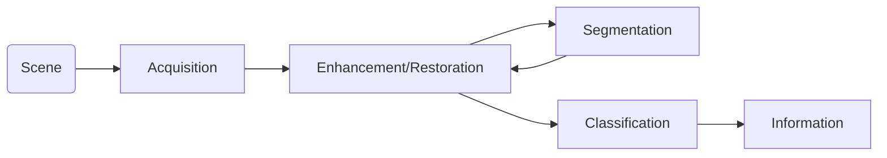

### Examples:

| Note                                                         | Diagrams                                                     |
| :----------------------------------------------------------- | ------------------------------------------------------------ |
| Underlying goal of image segmentation:<br />      is to **partition** an image into **homogeneous** **regions** | 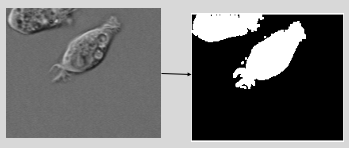 |
| **Texture-based Segmentation**:<br />With proper features, scenes can be segmented based on texture appearance | 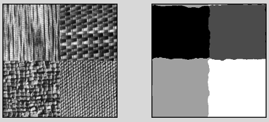 |
| **Segmentation of Radar-based Satellite Ocean Imagery**      | 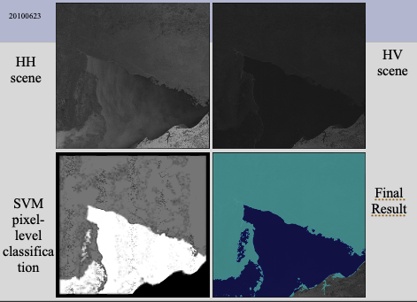 |

### Q&A:

#### Why Segment?

- Segmentation allows objects and regions to be analysed in a more meaningful manner 
- Some applications of segmentation:
  - Object tracking
    - ex: people tracking for surveillance purpose
  - Medical image analysis
    - ex: tumor growth analysis
  - Remote sensing analysis
    - ex: determine the ratio of diff. types of sea-ice within a region
  - Face recognition
    - ex: partition face into individual parts for component recognition

#### Bottom-Up vs. Top-Down

- B-U Segmentation:
  - Segment image into regions and then identify those regions that correspond to a single object
  - Uses features such as consistent grey level or tecture
    - And/or identification of boundaries to identify the object
- T-D Segmentation:
  - Use prior knowledge of the object (ex: shape, color, texture) to guide segmentation
- Example: identify all cows in an image database


---

## 7.2 - Histogram Methods

### Intro - Histogram Methods:

- Simplest and computationally efficient form of segmentation

#### Concept:

| Note                                                         |                                                              |
| ------------------------------------------------------------ | ------------------------------------------------------------ |
| - Consider Image Histogram                                   | 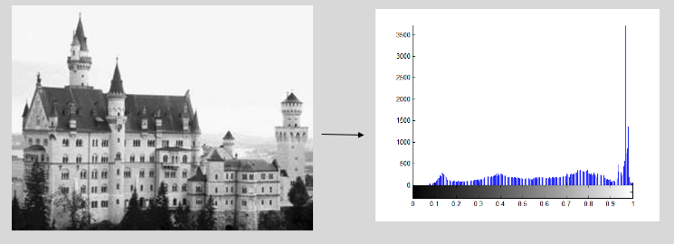 |
| - Analyze peaks of the histogram to determine the appropriate point for thresholding<br />- **Challenge**: to determine appropriate peak (ex: to separate background and foreground) | 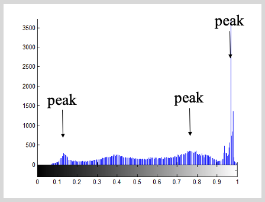 |
| - **Goal**: Determine an appropriate point of thresholding based on what we want (ex: segment foreground and background) | 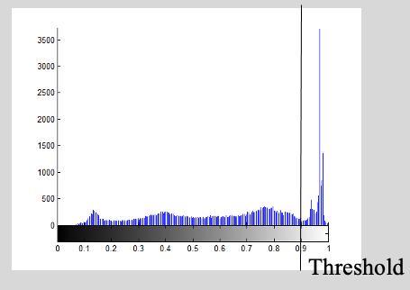 |
| - Set all pixels to a set of fixed values based on threshold<br />- Binary thresholding in example => | 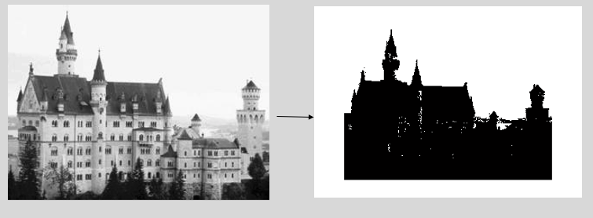 |

#### Problems with Finding a Threshold:

1. Histogram is **typically noisy** so difficult to isolate an appropriate T automatically
2. Peaks may not be noticeable due to **noisy appearance** and **large class variances** (may even appear unimodal)
   - Ex: sometimes, two peak may forma unimodal curve, and make it indistinguishable from the rest histogram
3. **Illumination differences** across image makes setting a **global threshold erroneous**
   - Ex: non-stationarity problem
4. Regions may be **discriminable** using other descriptors
   - Ex: texture (If its texture, it has pattern. Histogram is not good at capturing such)

#### Possible Solutions

1. [Otsu's Method](#Otsu's Method): use statistics from histogram to find threshold
   - Anytime with a clear contrast between the background and foreground
2. Use **"clustering"**
   - ex: use criterion to group pixels into appropriate classes
     - Ex: [Two Clustering-Based Methods (K-means & Finite Mixture Models)](#Two Clustering-Based Methods (K-means & Finite Mixture Models))
       - => also see SD 372 - Pattern Recognition
3. Use method that accounts for spatial (within-image) relationships
   - Ex: Markov random fields [Advanced - we won't cover.]

### Otsu's Method

- **Standard method** for **blind**, **histogram**-based thresholding 
- "A Threshold Selection Method from Grey Level histograms" (IEEE, 1979)
- Form a probability distribution $p_i$:

  - $p_i = \frac{n_i}{N}$
  - Where:
    - $N$ represents total num of pixels 
    - $n_i$ represents num of pixels at each grey level

#### Otsu's Equation (Derivation & Sketch):

| Sketch:                                                      | [Wiki](https://en.wikipedia.org/wiki/Otsu%27s_method)        |
| ------------------------------------------------------------ | ------------------------------------------------------------ |
|  |  |

| Derivation - Otsu's Equation                                 |
| ------------------------------------------------------------ |
| <br />Probabilities of class occurrence:                     |
| ==$\omega_0 + \omega_1 = 1 \\\begin{align}\omega_0 & = p_r (C_0) = \sum^{K}_{i=1} P_i = \omega(k) \\\omega_1 & = p_r (C_1) = \sum^{G}_{i=K+1} P_i = 1 - \omega(k)\end{align}$== |
| <br />Overall Probability:                                   |
| $\begin{align}\mu  & = \sum^{G}_{i=1} i \,p_i \\	 & = \omega_0 \mu_0 + \omega_1 \mu_1  \qquad \text{(weighted average)}\\		 &= \sum^{K}_{i=1} i \,p_i + \sum^{G}_{i=K+1} i \,p_i\end{align}$ |
| <br />Hence:                                                 |
| ==$\begin{align}\mu_0  & = \frac{\sum^{K}_{i=1} i \,p_i }{\omega_0} \\\mu_0  & = \frac{\sum^{G}_{i=K+1} i \,p_i }{\omega_1} \\\end{align}$== |
| => Now have $\mu_0$ and $\mu_1$ as functions of k.<br />=> need to optimize based on some criterion.<br /><br />Here, use between-class variance:<br />$\begin{align} &\text{If } \mu(k)=\sum^k_{i=1} i \, p_i \\ & \qquad\Rightarrow \mu_0 = \frac{\mu(k)}{\omega(k)} \qquad \mu_1 = \frac{\mu - \mu(k)}{1 - \omega (k)} \\ & \qquad \Rightarrow \sigma_B^2 \overset{\Delta}{=} \omega_0 (\mu_0 - \mu)^2 + \omega_1 (\mu_1 - \mu)^2  \end{align}$<br /><br />The algorithm exhaustively searches for the threshold that minimizes the intra-class variance, defined as a weighted sum of variances of the two classes: $\sigma_B^2$<br />You want two cluster is far as possible in histogram.<br />$\begin{align}\sigma_B^2(k) &= \omega(k) \left[\frac{\mu(k)}{\omega(k)} - \mu\right]^2 + [1 - \omega(k)]\left[\frac{\mu - \mu(k)}{1 - \omega(k)} - \mu \right]^2 \\ &= \omega(k) \left[\frac{\mu(k)- \mu}{\omega(k)}\right]^2 + [1 - \omega(k)]\left[\frac{\mu(k) \mu - \mu(k)}{1 - \omega(k)}\right]^2 \\ & = \frac{[\mu \omega(k) - \mu(k)]^2}{\omega(k)} + \frac{[\mu \omega(k) - \mu(k)]^2}{1-\omega(k)} \\ &= \frac{[1- \omega(k)][\mu \omega(k) - \mu(k)]^2 + \omega(k)[\mu \omega(k) - \mu(k)]^2}{\omega(k) [1 - \omega(k)]} \\  &= \frac{[\mu \omega(k) - \mu(k)]^2}{\omega(k) [1 - \omega(k)]}\end{align}$<br /><br />Hence:<br />$\begin{align}\sigma_B^2(k) = \frac{[\mu \omega(k) - \mu(k)]^2}{\omega(k) [1 - \omega(k)]} \end{align}$<br /> |

#### How to Implement?

| Implementation                                               |
| :----------------------------------------------------------- |
| <br />Matlab: just calculate $\sigma_B^2(k)$ as a vector     |
| <br />Programming: use update equations recursively for efficiency<br />EX:<br />$\begin{align} \mu(k) &= \sum^{k}_{i=1} i \, p_i \\ \mu(k+1) &= \sum^{k+1}_{i=1} i\, p_i = \sum^{k}_{i=1} i \, p_i+ (k+1)\,P_{k+1} =  \mu(k) + (k+1)\,P_{k+1} \\ \omega(k) &= \sum^{k}_{i=1} = P_i \\ \omega(k+1) &= \omega(k) + P_{k+1} \\ \mu & = \textbf{constant} = \sum^{G}_{i=1} i\, p_i \end{align}$<br /> |
| <br />**Example 1 - Otsu's Method**:<br />- Anytime with a clear contrast between the background and foreground<br />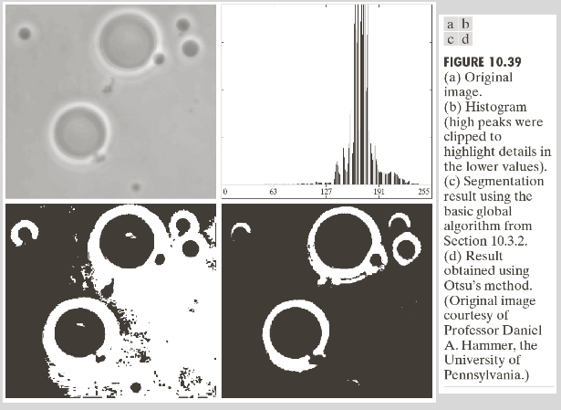 |
| <br />**Example 2 - Smoothing + Otsu's Method** <br /><br />- after applying the smooth, u get bimodal instead of unimodal peaks, and run Otsu's method to separate foreground and background<br />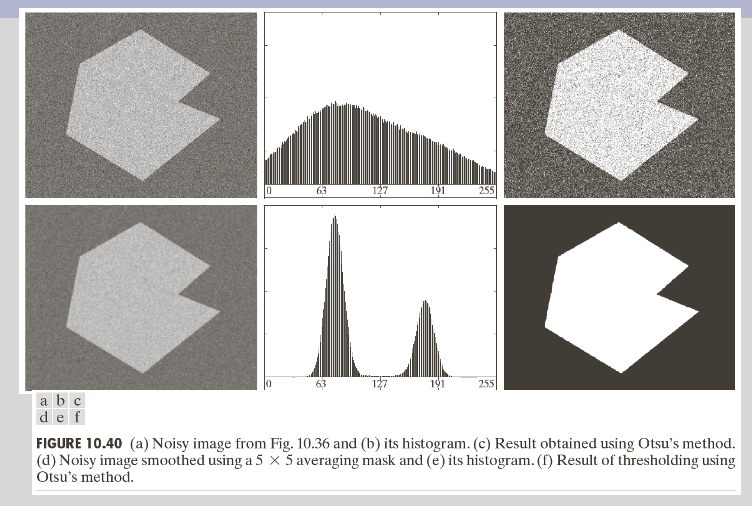 |

```matlab
function level = otsu(histogramCounts)
  total = sum(histogramCounts); % total number of pixels in the image 
  %% OTSU automatic thresholding
  top = 256;
  sumB = 0;
  wB = 0;
  maximum = 0.0;
  sum1 = dot(0:top-1, histogramCounts);
  for ii = 1:top
      wF = total - wB;
      if wB > 0 && wF > 0
          mF = (sum1 - sumB) / wF;
          val = wB * wF * ((sumB / wB) - mF) * ((sumB / wB) - mF);
          if ( val >= maximum )
              level = ii;
              maximum = val;
          end
      end
      wB = wB + histogramCounts(ii);
      sumB = sumB + (ii-1) * histogramCounts(ii);
  end
end
```


### Two Clustering-Based Methods (K-means & Finite Mixture Models)

| **K-means [LAB + TUT]**                                      | **Finite Mixture Models**                                    |
| ------------------------------------------------------------ | ------------------------------------------------------------ |
| <br />- Create **partitions** by **grouping** pixels into **clusters** | <br />- Suppose we know that there are $m$ clustes/classes in the image<br />- Suppose that the probability distribution of each cluster/ class can be modeled using a parametric model (ex: Gaussian, Gamma, Cauchy, etc.)<br />=> Turns into a Model based clusterization <br /><br />- **Idea**: We can model the probability distribution of the image as a mixture of $m$ different probability ditributions, one for each cluster/class<br />- **Formulation**:<br />$\begin{align}f_X(x) = \sum^{m}_{i=1} a_i \, f_{Y_i}(x)\end{align}$<br />- **Goal**: <br />    - Determine this set of $m$ distributions <br />    - and determine which pixel values belong to each cluster/class based on which of these distributions give the highest probability |
| <br />- **Steps for K-means** ("migrating means") clustering:<br />   1. **Pick** (randomly) K pixels to act as the **initial centers** of the clusters (K: number of classes)<br />   2. Assign each **pixel** to one **cluster** based on minimum Euclidean distance<br />   3. If no pixels change clusters => STOP; otherwise, **recalculate cluster means** based on new pixel assignments<br />   4. Return to Step 2.<br /><br />**Sketch** of the steps:<br />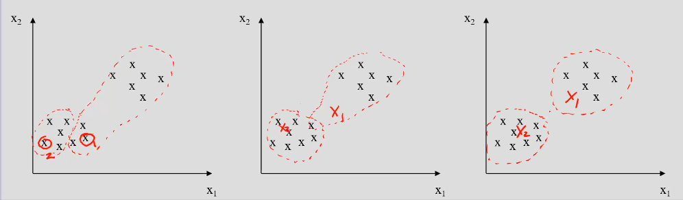<br />- Hopefully we reach the global munimum in 3rd plot, (not always happen) | <br /><br /><br />**- Steps:**<br />.    1. Learn the parameters of the distribution models for the $m$ clusters<br />.           - ex: for Gaussian, learn the mean and std. deviation<br />.    2. For each possible pixel:<br />.            2-1) Determine the probability that its pixel intensity belongs to each of the $m$ clustes based on the distribution model<br />.            2-2) Assign the pixel's cluster label to the cluster that provides the highest probability<br />.     3. Therefore, thresholds between clustes coincide at points of **equal probabilities**<br /><br /> |
| <br />**K-means Example** - Three class segmentation:<br /> | **<br />Example:** Suppose we have two classes modeled by 2 Gaussians <br />($\begin{equation}\mu_1 = 3, \sigma_1 = 1, \mu_2=5, \sigma_2=1\end{equation}$)<br />- What is the threshold between these two classes?<br />.     => Set up distribution equations for each class<br /><br /><br />=> Since threshold is at point of equal probabilities:<br /> |

### Histogram Segmentation - Pros and Cons

#### Advantages:

- Efficient (usually requires only one pass for simple segmentation cases)
- Good for multiple ditinct partitions in histogram

#### Disadvantages (Limitations):

- Often difficult to determine proper peaks in the histogram
- Difficult in situations where intensity is not sufficient to distinguish between two partitions
  - Ex: textured regions containing different mixes of intensities
- ==No spatial context==


---

## 7.3 - Edge-Based Methods

### Intro. 

- **Edges**: defined as any pixels that belong to a line defining ==a high rate of change==
- **Boundaries**: **defined as edges** that **separate regions** that are homogeneous in same feature
- Example: a region might contain a textured pattern that contains many edges

#### Segmentation Using Edge Strength

- For Segmentation based on edge strength:
  1. Perform edge detection
  2. Convert **edges** to **closed contours** (boundaries), 
     - since edges detection:
       - a) misses boundaries
       - b) detects edges that are not boundaries

### Morphological Operators

#### Image Morphology

- Image morphology provides a means to **convert** detected **edges** into **closed** **contours** (**boundaries**) that are more meaningful
- Morphology provides a means to perform edge linking (to complete boundaries) and removing serious edges that do not represent boundaries

- **Morphology**: ==form and structure of an object==
- Note: focus here will be on binary images, but concepts can be extended to n grey levels

##### General Ideas:

- Two Basic Morphological operations: 

  - **Dilation**: Set pixel to 1 if any neighbouring pixels are the value 1

  - **Erosion**: Set pixel to 0 if any neighbouring pixels are the value 0

    

  

#### Translation:

- Mathematically, morphology can be implemented using set theory.
  
  - Set A: set of all white pixels (ex: detected edges)
- Translation: $(A)\gamma = \{ c | c = a + \gamma, a \in A \}$
  - Where $a,c,\gamma$ are in (x,y) coordinates
  
  - Basic building block for **Dilation and Erosion**
  
    
  
    

#### Dilation ==OR Gate==:

- Dilation: $C = A \oplus B = \{ c \,\vert\, c = a + b, a \in A, b \in B \} = \underset{b\in B}{\bigcup} (A)_b = \underset{a\in A}{\bigcup}  (B)_a$ (commutative)
  - A: image
  - B: "structuring element"
    - set of pixels referred to as the "structuring element" which defines the nature of the dilation
    - can take any shape
- Example: 
  - if $B = \{ (0,0), (1,0)\}$ = [  x  |     ]
  
  - $C = A \oplus B = (A + \{0,0\}) \bigcup (A + \{1, 0\})$
  
    
  
  - $C$ is a dilation of $A$ using structuring element $B$

#### Erosion ==AND Gate==:

- Erosion:  $C = A \ominus B = \underset{b\in B}{\bigcap} (A)_{-b}$ (not commutative)
  - A: image
  - B: "structuring element"
- Example:
  - $B = \{ (0,0), (1,0)\}$ = [  x  |     ]
  
  - $C = A \ominus B = (A + \{0,0\}) \bigcap (A + \{-1, 0\})$
  
    
  
  
  
  - $C$ is an erosion of $A$ using structuring element $B$

#### Openings (ED) and Closings (DE)

- Normally, single dilation/erosions not used
  
  - Often, these are iterated
  
- O/C: Combination of D/E in different order

- **Opening**: erosion followed by dilation using same structuring element

  

  

- **Closing**: dilation followed by erosion using the same structuring element

  

  

### Active Contours ("Snakes") - Advanced Method

- Create partitions by forming rough boundaries around regions/objects of interest

  - and refining the boundaries until it matches the actual boundaries of the objects

- **Steps:**

  - Create initial, approximate boundary around the object
  - Calculate energy gradient between the current location of the boundary and its neighboring pixels
  - Expand or contract the boundary based on the gradient

- **Ex**:

  

  

- **Optimization function** based on two components that are summed:

  1. ==External force== (normally an edge gradient)
  2. ==Internal stiffness== (resistance to bending to offer some form to the system)

#### Decoupled Active Contour

|                                                              |                                                              |
| ------------------------------------------------------------ | ------------------------------------------------------------ |
|  |  |

#### Pros and Cons:

##### Advantages:

- Good for segmentating and tracking objects with deformable motion and clear boundaries
- Motion information can be extracted from the contour

##### Disadvantages:

- Relatively slow
- Ill-suited for situations where your regions do not have clearly defined boundaries
- Sensitive to noise
- Multiple objects need separate initializations which requires user interaction


