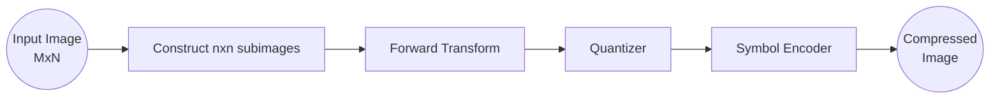
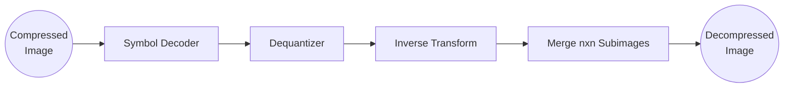
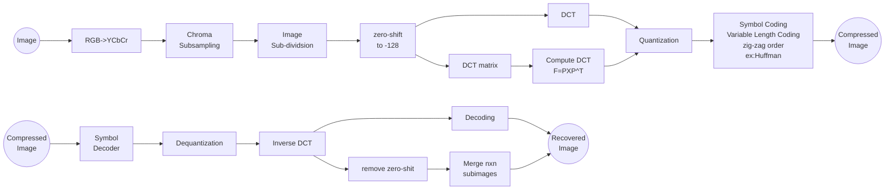
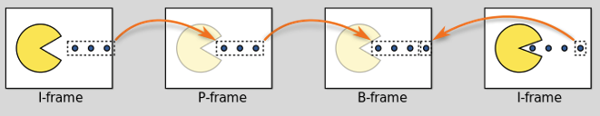

# 8. Image Compression

[TOC]

---

## 8.1 Concepts

### Why Compress Image?

- Popylarity of digital imaging systems 
  - (EX: digital still-image/video cameras, digital x-ray/CT/MR/ultrasound systems, scanners)
  - has lead to a large volume of imaging data being created each day
- Uncompressed digital images have considerable storage and transmission **bandwidth requirements**
- To help with these problems, image and video **compression** is a necessity

### Concept:

- Goal:
  - reduce amount of data that needs to be stored to represent an image
- Idea:
  - reduce the amount of redundant data that needs to be stored to reconstruct image
- Transform image data into a form that reduces statistical correlation and reduces information redundancy

### Graph of Various Compression Techniques

### Three Types of Redundancy

#### Types:

- Images can be generally described by three types of redundancies
  1. **==Coding== Redundancy**
  2. **==Spatial and temporal== redundancy**
  3. **==Psycho-visual== redundancy/ Irrelevant Information**
     - Color is sth. we can squeeze down a lot, since HVS is not chromatic senstive relative to illumination changes

  

#### 1. Coding Redundancy:

- Gray levels in an image can be viewed as random variables

- **Histogram** shows the **probability** that **each** **gray** level **appears** in an image

- In most images, certain gray levels are more probable than others

- By adjusting code length based on probability of gray levels, one can reduce coding redundancy

- Example:

  

#### 2-a. Spatial Redundancy [Images]

- Most **images** possess a lot of structural and intensity self-similarity

- Therefore, value of a given pixel or region can be reasonably predicted by **neighboring pixels** or regions

  - ==neighboring pixels has high correlations==

- One can take advantage of this **self-similar nature of images** to **reduce** the amount of information that needs to be stored.

- Example:

  

#### 2-b. Temporal Redundancy [Video]

- In a **video sequence**, **pixels and/or regions** within each frame are similar to or dependent on pixels and/or regions from **adjacent frames**.
- Therefore, they can be reasonably predicted by temporally neighboring pixels or regions to reduce the amount of information that needs to be stored.

#### 3. Psycho-visual Redundancy

- Eye doesn't respond equally to all visual information

- Certain information less important than others to the human vision system

  - Examples:
    - **More** sensitive to **illumination** changes than color changes
    - **Less** sensitive to **distortions** in **textures** than uniform regions
    - **Less** sensitive to **distortions** at **high spatial frequencies**

- Can reduce the amount of information needed to represent an image by removing information that's non-essential for visual processing

  - Examples:
    - Store **less color** information
    - Store **less information for uniform regions** than structures such as edges
    - Store **less information about high frequency** image characteristics

- Example:

  

### Image Compression Framework

#### Types of Image Compression

##### Lossless Compression

- ==Exploits **coding** redundancy==
- **Advantage**: 
  - all of the image information is retained (allows for perfect image reconstruction)
- **Disadvantage**: 
  - poor compression performance
- **Examples**: 
  - Run-length encoding
  - Dictionary algorithms (e.g., LZW)
  - Entropy encoding (e.g. Huffman, arithmetic)
- ==Note: sacrifice compression for retaining data fedality==

##### Lossy Compression

- Decompressed image is **different** but **close enough** to original image
- ==Exploits **spatial** and **psycho-visual** redundancies==
- **Advantages**:
  - High compression performance
- **Disadvantages**:
  - Loss in original image information
- **Examples**:
  - JPEG and MPEG

###### Lossy - Fixed-rate Compression

- The compression rate achieved is the same for all images
- **Advantages**:
  - ==Simple and fast decoding==
  - Allows for ==random access of information==
- **Disadvantages**:
  - ==Low compression performance==
- **Popular application**: 
  - texture compression for real-time 3D applications (e.g., DXTC)
  - computer graphics

###### Lossy - Variable-rate Compression

- The compression rate achieved varies depending the underlying image characteristics
- **Advantages**:
  - ==High compression performance==
- **Disadvantages**:
  - ==More complex to encode and decode==
  - ==Difficult to randomly access== information
- Popular **application**:
  - **still image** and video compression (e.g., ==JPEG==/MPEG)

---

## 8.2/3 Coding Methods

### Coding Methods:

- **Huffman Coding**
  - **Lossless**
  - **Variable Rate** (data dependent)
  - Used as **final step** in **JPEG**, MP3, etc.
- **Block** **Transform Coding** **(BTC)**
  - **Lossy**
  - **Fixed Rate (deterministic)**
  - Used in computer graphics

### 1. Variable Length Coding (**Huffman Coding** : Tree Graph Based : Unicoding : ==Lossless==)

- Decrease code length as probability of occurrence increases

- Can achieve **much lower coding redundancy** by reducing **the number of bits** needed to **store** data in an image

- Problem: how do we actually determine what code to use?

  - One set of codes typically not well-suited for all images 

- **==Decrease code length as probability of occurrence increases==**

- **Example:**

  

  - For ‘Code 1’: 

    - average number of bits required to code image is 8 bits per pixel (bpp)

  - For ‘Code 2’: 

    

  - Code 1 has **high coding redundancy** as it requires more bits than necessary to code

#### Approach: Huffman

- Popular method for removing coding redundancies is *Huffman coding*
- Used extensively within common standards for compression (JPEG, H.264, MPEG-1,2,4, etc.)
- Based on probabilities
  - **Most** commonly **occurring** symbol receives **shortest** code
  - **Least** common symbols receive **longest** codes
- Source symbols can be intensities, pixel differences, run lengths, etc.

##### Data-Adaptive Variable Length Coding

- Idea of Huffman coding: change the set of codes used to compress achieve better compression **specifically for the image**
- Note: Huffman will be used to **code coefficients** produced by a **filtering** process, not the image data directly, using JPEG

###### ==Huffman Coding : Lossless==

- **Goal:** Build minimal length encodings based on frequency of occurrences in the image

- **Steps:**

  1. Determine frequency of occurrences for each possible value in the image

     

  2. Construct **Huffman tree**

     - Huffman Trees are ==**binary trees**== where:

       - Root node has highest probability of occurrence
       - Lowest leaf nodes have the lowest probability of occurrence
       - Probability of occurrence decreases as we traverse down the tree

     - Detailed Steps: 

       | Action                                                       | Graph Example                                                |
       | ------------------------------------------------------------ | ------------------------------------------------------------ |
       | 2-a). Take the two lowest occurrences as the leaf nodes and the sum of the occurrences as their parent node |  |
       | 2-b). Compare value of the parent node with next lowest occurrence           -Lower of the two becomes left child node           -Higher of the two becomes right child node           -Sum of the two becomes parent node |  |
       | 2-c). Repeat until all values have been used                 |  |
       | ...                                                          |  |
       | 2-d). Assign '1' to the left child node and '0' to right child node |  |
       | 2-e). Replace leaf nodes with their corresponding values     |  |

       

  3. **Encode image** based on codes generated from **Huffman tree**:

     - | Action (cont.)                                               | Graph Example                                                |
       | ------------------------------------------------------------ | ------------------------------------------------------------ |
       | 3-a). Compute set of codes from Huffman tree by traversing tree |  |

###### Decoding

- Q: [cont. from Huffman tree example]
  - So, if you had a sequence:
    - 10110111001101100101000
  - How would you decode it?
    - 1-01-1-01-1-1-0011-01-1-0010-1-000
      - ==**Unicoding** => Lossless==
  - Or
    - 3,0,3,0,3,3,10,0,3,6,3,2
- A:

###### ==Compression Efficiency==

- A: [cont. from Huffman tree example]

  

  - This gives us a compression ratio of:
    - 8 bits per coefficient/2 bits per coefficient = 4:1

###### Another Huffman Coding Example

- Compatibility K-Lite Codec pack
  - “internationally sanctioned” = approved by ISO – International Standards Organization or IEC or ITU-T
  - HEVC (high ef)
  - successor to HEVC is under active development. Known as VVC (Versatile Video Coding), the standard is due for completion in October 2020 and is likely be approved as H.266 (VVC). Working Draft 3 of the VVC specification was released in October 2018, so the work towards standardisation is broadly on track. However, the licensing model for VVC remains unclear until the standard is complete and essential features of the codec are finalised. The Media Coding Industry Forum – formed in September 2018 – is working to avoid the problematic patent situation that has hitherto thwarted HEVC’s widespread adoption across the industry.ficiency video coding) to be released in 2020; one-quarter size of MPEG-2 to achieve 4K resolution

### 2. Fixed-rate Compression (Palette-based Compression)

- Idea: 
  - As mentioned earlier, values of pixels can be well predicted by neighboring pixels
  - Instead of storing all pixel values, store a few pixel values that are representative of the neighborhood
  - Encode other pixels in the neighborhood as the closest value in the palette

#### Block Truncation Coding (BTC) : ==Lossy Compression==

- Blocked-Based Coding

  - Block-based algorithm that preserves local mean and standard deviation of image

- NOTE:

  - Not the same as Block Transform Coding; perhaps a subset or rudimentary form of Block Transform Coding.

- **Steps:**

  | Instructions                                                 | Examples                                                     |
  | ------------------------------------------------------------ | ------------------------------------------------------------ |
  |  1.Divide image into 4x4 pixel blocks 2. For each block, compute the mean and std. deviation of pixel intensities |  |
  | 3. Classify each pixel in the block as follows $g(x,y) =\begin{cases} 1, & f(x,y)>\mu \\ 0, & f(x,y) \leq \mu\end{cases}$ |  |
  | 4. Store binary block along with mean and standard deviation 5. To decode, compute decoding values l (low) and h (high) based on mean and standard deviation $l = \mu - \sigma \sqrt{\frac{n_{x>\mu}}{n_{total}-n_{x>\mu}}}$ $h = \mu + \sigma \sqrt{\frac{n_{total}-n_{x>\mu}}{n_{x>\mu}}}$ NOTE: Once a threshold, xth, is selected the output levels of the *quantizer* (a and b) are found such that the first (mean) and second moments are preserved in the output. |  |
  | 6. Decode binary block as follows $\hat{f}=\begin{cases} h, & g(x,y)=1 \\ l, & g(x,y)=0\end{cases}$ |  |

###### BTC Compression Rate

- Suppose we are given a 4x4 grayscale image, with each pixel represented by a value from 0 to 255.
- Number of bits required to store this image in an uncompressed format is 4x4x8bits = 128 bits
- Bit rate of image in an uncompressed format is 8 bpp (bits per pixel)
- **EX:**
  - Supposed we compress the image using BTC
  - Mean and standard deviation each require **8 bits**
  - Binary block requires **4x4x1bit=16 bits**
  - Number of bits required to store this image in BTC compressed format is  
    - **16bits**+2x**8bits**=**32 bits**
  - Bit rate of image in BTC compressed format is **32bits**/**16pixels** = **2 bpp** (bits per pixel) 
    - [Compression rate = ==8 bpp:2 bpp== or **4:1**]

### 3. Transform-Based Compression : ==Lossy Compression== : Freq. Based

- As mentioned earlier, we wish to transform image data into a form that **reduces statistical correlation**
- We also saw that when images are transformed into the **frequency domain** using the **Fourier Transform**
  - Most of the energy **resides** in **low frequency** components
  - A good approximation of the original image can be **reconstructed** using a **few components** 

#### Block Transform Coding

- Idea: What if we apply an image transform like the Fourier Transform to an image and ==**encode the transform coefficients** in a **reduced, lossy**== form instead?
- Many of the transform **coefficients** have **low** associated **energies** and **can be discarded or coarsely quantized** with little image distortion
- **Issue**: Image **transforms** such as Fourier Transform are have relatively expensive from both computational and storage perspective
  - Must **hold all data in memory at once** to perform transform
  - Must **account for all pixels** in image when **computing** transform
- Difficult to implement in consumer-level devices such as DVD players and digital cameras
- **Solution**: 
  - Break images into a set of ==smaller sub-images (''**blocks**'')==
  - Apply image transform on the sub-images independently
- **Advantage:**
  - The amount of information that needs to be **stored** to **transform** a sub-image is **small**
  - Since all operations are **independent**, they can be **performed in parallel** to improve computational efficiency 

#### Framework

##### Compression Flowchart

##### Decompression Flowchart

#### Image Transforms

- Converts images from one representation (e.g., spatial) to another (e.g., frequency)

- **Forward transform**

  - $T(u,v) =\underset{x=0}{\overset{n-1}{\sum}}\underset{y=0}{\overset{n-1}{\sum}}g(x,y)\,r(x,y,u,v)$

  

- **Inverse transform**

  - $g(x,y) =\underset{u=0}{\overset{n-1}{\sum}}\underset{v=0}{\overset{n-1}{\sum}}T(u,v)\,s(x,y,u,v)$

  
  
  - Essentially representing an image using a set of basis functions

###### Selection of Image Transforms

- Selection of image transform is very important to compression performance as well as computational performance
- Some well-known image transforms:
  1. Karhunen-Loeve (KL) transform
  2. Fourier transform (FT)
  3. Walsh-Hadamard transform (WHT)
  4. Discrete cosine transform (DCT)

###### Table of Four Image Transforms

| Transforms                                                   | Pros & Cons                                                  |
| ------------------------------------------------------------ | ------------------------------------------------------------ |
| ==** Karhunen-Loeve** **(KL) transform**==  - Optimal transform in terms of compression .    - Minimizes mean square error  .    - Statistically decorrelated (off-diagonal elements of covariance matrix are zero)   NOTE: Also known as **principal components analysis (PCA)**  - Basis functions essentially based on the **eigenvector** - **Eigenvectors** associated with **highest eigenvalues** will be associated with **most variance** |  **Advantages**: - Provides ==optimal compression performance== from an energy compaction perspective **Disadvantages**: - ==Computationally expensive==, since the transform is data-dependent and deriving basis functions is non-trivial => not good for operational compression. |
| **Fourier transform** - Transformation kernels   | **Advantages**: - ==Hardware acceleration== available on CPUs **Disadvantages**: - -Relatively ==poor compression performance== |
| **Walsh-Hadamard Transform (WHT)** - Transformation kernels   - NOTE: $b_i(x)$ is the ith bit (from right to left) in the binary representation of (x), $p_i(x) = b$ - WH kernels consist of **alternating** plus (white) and minus (black) 1s in **checkerboard** pattern   | **Advantages**: - ==Computationally simple ==**Disadvantages**: - Relatively poor compression performance (==worse than Fourier transform==) |
| **==Discrete Cosine Transform (DCT)==** - Transformation kernels   -NOTE: Forward and inverse transforms are the same, therefore, easier to implement in hardware.  - Kernel Ex:   | **Advantages**: - **Computational efficient** (easy to implement in hardware) - **High compression performance** (closely approximates performance of KLT for many images)  => Given these benefits, DCT has become an international **standard** for transform coding |

### How do we deal with Color?

- As mentioned before, RGB color space is highly redundant and correlated
  - Reduces compression performance
- **Solution**: Use a color space that decorrelates information such as luminance and color
  - e.g., Before image transform, convert image from RGB color space to **YCbCr**
  - Allows luma and **chroma** channels to be processed independently

#### ==Chroma Subsampling==

- The human vision system is significantly more sensitive to variations in brightness (luma) than color (chroma)

- **Idea**: 

  - **reducing** the amount of chroma information stored compared to the amount of luma information should **have little impact** on perceived image quality

- **Example: JPEG**

  - In JPEG, image is converted from RGB to YCbCr 

  - The resolution of the Cb and Cr channels are reduced

  - Commonly, the Cb and Cr channels are sub-sampled by at factor of 2 both horizontally and vertically

    

#### ==Sub-image Construction==

- After chroma **subsampling**, the individual channels are divided into a set of **n *x* n sub-images**

- Generally, compression **performance** **increases** as sub-image size **increases**

- However, computational **complexity** **increases** as sub-image size **increases**

- Drawing a balance between compression performance and compression efficiency, 8x8 and 16x16 sub-image sizes are used 

- **Reconstruction Error vs. Sub-image Size:**

  

- **Reconstruction Quality vs. Sub-image Size:**

  

### ==Quantization==

- As mentioned earlier, the human vision system is much more sensitive to variations in low frequency components than high frequency components

- Also, much of the energy is packed in the low frequency components

- **Idea**: 

  - **high frequency** components can be represented **coarsely (“quantized”)** without perceptually noticeable degradation in image quality

- **Steps:** 

  1. Transform image *f* from the spatial representation to *T* in the transform domain

  2. Quantize *T* based on a quantization matrix *Z* designed for the human vision system based on perceptual importance

     

- ==**Quantization Matrix (JPEG)**==

  

  Big deonimators -> Big quantization in high frequency (Bottom-Right corner)

- **Effect of Quantization Level on Image Quality**

  

  - Observations:
    - As quantization increases
      - **fine** image **detail** starts **to be los**t (e.g., mouth and feathers start to degrade until completely disappearing)
      - **==Blocking artifacts==** (i.e., visible boundaries between sub-images) becomes increasingly prominent
    - However, uniform regions with little detail are significantly less affected by quantization

- **Adaptive Quantization**
  - Fact:
    - **High** quantization is **perceptually acceptable** in **uniform** regions
    - **Low** quantization is **needed** in regions with **structural detail**
  - **Idea:** 
    - Adjust degree of quantization based on amount of image detail within a sub-image
      - **Measure level of image detail** (e.g., variance) of the sub-image
      - **Decrease** **quantization** for **sub-images with** **high image detail**

---

## 8.4 JPEG Detailed Process (Table):

| Steps                                                        |
| ------------------------------------------------------------ |
|  1. **Color Space Transform** - Convert image from RGB Color space to YCbCr color Space  |
|  2. **Chroma Subsampling** - Reduce the resolution of Cb and Cr channels by a factor of two in each dimension.  |
|  3. **Image Sub-division** - For each channel, divide the image into 8x8 blocks  |
|  4. **Zero-shift** - For each block, shift values by -128 to center around zero .    “Zero shift reduces the internal precision requirements in the DCT calculations.”  |
|  5. **DCT** (**Discrete Cosine Transform**) **Kernel** - Note: Figure helps to visualize the filters, not how implemented in practice!!!!  - (0,0): 1st 4x4 filter : averaging filter => Sub Img * Each Filter (Convolution) => 4x4 block  => ==this is a visualization but not actual implementation, proceed for **Step 6,7 with DCT Matrix** == - Top Left: low frequency, Bottom Right: high frequency |
|  6. **DCT Matrix** - Composed of 8x 1-D cosines of varying frequencies (arranged in rows)                - Calculated using 1-d version of DCT formula introduced in Section 8-3 .     - Each row is calculated using a 1-d version of the 2-d version of the DCT in Section 8.3.                  T = dctmtx(SIZE); |
|  7. **==Compute DCT:==** $F=PXP^T$         **DCT Memory Requirements**  - Notice that the DC coefficient (i.e., F(0,0)) requires more than 8 bits to represent - Since much of the energy is stored in the DC coefficient      - Therefore, internally, more bits are required for storage during DCT computation      - This does not increase memory requirements that much as we are only operating on small 8x8 blocks at a time.  floor(blkproc(f - 128, [8, 8], 'P1 * x * P2', T, T')); |
|  8. **Quantization** - Divide DCT coefficients by quantization matrix              - Quantized coefficients composed of mostly zeros and small values - 0s are those not recoverable, lost by quantization   round(blkproc(F_trans, [8 8], 'x ./ P1', k*Z)); |
|  9. **Variable-Length Coding** 1. Arrange coefficients in ==zig-zag order  ==2. Apply a run-length ==sequential encoding scheme ==- Perform variable-length coding (e.g., Huffman)   OTHER NOTE: This encoding mode is called baseline *sequential* encoding.  Baseline JPEG also supports *progressive* encoding. While sequential encoding encodes coefficients of a single block at a time (in a zigzag manner), progressive encoding encodes similar-positioned coefficients of all blocks in one go, followed by the next positioned coefficients of all blocks, and so on. So, if the image is divided into N 8×8 blocks {B0,B1,B2, ..., Bn-1}, then progressive encoding encodes Bi(0,0) for all blocks, i.e., for all i = 0, 1, 2, ..., N-1. This is followed by encoding Bi(0,1) coefficient of all blocks, followed by Bi(1,0)-th coefficient of all blocks, then Bi(2,0)-th coefficient of all blocks, and so on. It should be noted here that once all similar-positioned coefficients have been encoded, the next position to be encoded is the one occurring next in the zigzag traversal as indicated in the figure above. It has been found that Baseline Progressive JPEG encoding usually gives better compression as compared to Baseline Sequential JPEG due to the ability to use different Huffman tables (see below) tailored for different frequencies on each "scan" or "pass" (which includes similar-positioned coefficients), though the difference is not too large. In order to encode the above generated coefficient pattern, JPEG uses Huffman encoding. JPEG has a special Huffman code word for ending the sequence prematurely when the remaining coefficients are zero. [ source Wikipedia ]  |
|  10. **Dequantizing**- **Recovering the Block** - Multiply quantized DCT coefficients by quantization matrix   |
|  11. **Apply Inverse of DCT** - Compute Inverse DCT   |
|  12. **Decoding** - For each block, shift values by 128 to remove the effects of zero-shift during encoding  - How do you calculate the MSE between the original block and the decoded block?   |
|   Extra Note on: **KLT Block Transform Compression**  - Recalculate every time => so its not efficient comparing to DCT - For each **8x8 block**, create a **64-d vector**  - Using all 64-d vectors from the image, calculate a 64x64 covariance matrix   - From the covariance matrix, determine the K largest **eigenvalues** that retain a certain % of the energy  - The transformation matrix is then the first K eigenvectors associated with the largest K eigenvalues |

---

## 8.5 Advanced Concepts

### DXTC: ==Fixed Rate==: Extends BTC

- Used for texture compression in the Direct3D standard
- Well suited for 3D real-time applications as it allows for random texel access
- Very fast due to hardware acceleration on all current video cards
- **Extends BTC (block transform coding) for color images**
- In addition to **spatial redundancy**, also takes advantage of ==**psycho-visual redundancy** (through **quantization**)==
- Also known as S3 Texture Compression (S3TC)
- **STEPS:**
  1. Divide image into **4x4 blocks**
  2. For each block, store two **16-bit representative color** values **C0 (high) and C1 (low),** where
     - 5 bits allocated for red
     - 6 bits allocated for green
     - 5 bits allocated for blue
  3. Compute two additional color values
     - $c_2 = \frac{2}{3}c_0 + \frac{1}{3}c_1$, $c_3 = \frac{1}{3}c_0 + \frac{2}{3} c_1$
  4. Assign a value from **0 to 3 (2 bits)** to each pixel based on which of the **four color values** they are **closest**
     - Requires storage for 4x4 two-bit lookup table for storage
  5. To decode, replace values from lookup table with one of the four color values
- NOTE:
  - **Texture compression** is a specialized form of [image compression](http://en.wikipedia.org/wiki/Image_compression) designed for storing [texture maps](http://en.wikipedia.org/wiki/Texture_map) in [3D computer graphics](http://en.wikipedia.org/wiki/3D_computer_graphics) rendering systems. Unlike conventional image compression algorithms, texture compression algorithms are optimized for [random access](http://en.wikipedia.org/wiki/Random_access). Four characteristics that differentiate texture compression from image compression: decoding speed (must be fast!), random access (ordering unknown), compression rate & visual quality (lossy compression tolerable), encoding speed (not critical)

#### DXTC Compression Rate

- Suppose we are given a **4x4 color image**, with each pixel represented by R, G, and B values ranging from **0 to 255** each

- Number of bits required to store this image in an uncompressed format is:

  -  **4x4x(3x8bits)=384 bits**

- Bit rate of image in **uncompressed** format is **384 bits/16 pixels = 24 bpp**

- Supposed we compress the color image using DXTC

- The **high and low representative color** values **C0 and C1** each require **16 bits**

- Each value in the **4x4 lookup table** represents **4 possible values**, thus requiring 4x4x**2bit**=**32 bits**

- Number of bits required to store in DXTC compressed format is **2x16bits + 32bits = 64 bits**

- Bit rate of color image in a DXTC format is 64bits/16pixels=4 bpp 

- The compression rate of DXTC for the color image can then be computed as

  -  $BPP_{uncompressed}:BPP_{DXTC} = 24:4 = 6:1$

- Image Example of DXTC

  
  
  -  Artifact at gradual transition

#### Observation

- Image remains **very sharp and clear**
- Solid, uniform regions are **well represented**
  - **Quantization does not perceptually affect image quality in this case**
- ==Blocking artifacts can be seen at smooth transitions==
- Reason: using a total of 4 colors does not sufficiently represent such regions, which require more color values to represent the smooth transition

#### Example Tbale

| ->                                                           | ->                                                           | ->                                                           |
| ------------------------------------------------------------ | ------------------------------------------------------------ | ------------------------------------------------------------ |
| 6:1 compression using DXTC  - Blocking artifacts at smooth transitions |  | Divide image into 4x4 blocks  |
| Store two 16-bit representative color values C0 (high) and C1 (low) in R5G6B5 format - Largest value in Euclidean distance | Compute two additional color values (e.g., using simple interpolation)  | Assign a value from 0 to 3 to each pixel based on closest color value  |
| To decode, replace values from lookup table with one of the four color values  |                                                              |                                                              |

### Normal Mapping

 

- Complex 3D models in a scene provide a greater sense of realism within a 3D environment
- However, its **expensive** from both a **computational and memory** perspective to process such c**omplex 3D models with high geometric detail**
- Solution: use **Normal Mapping** to give the **sense** that there is more geometric detail by changing **lighting** based on supposed **geometry**

- Create high resolution model and a corresponding low resolution model you want to use
  - Cast ray from each **texel** on **low-res model**
  - Find **intersection** of ray with **high-res model**
- Save the normal from high-res model where the ray intersects
- NOTE:
  - \- Faking the lighting of details in image e.g., “bump mapping”; add details without adding polygons

#### 3Dc

- Each pixel in a normal map has three values (x,y,z), which represent a normal vector

- The x, y, and z coordinates of a normal vector are independent from each other

- This makes **DXTC poorly** suited for compressing **normal** maps since it **relies on inter-channel correlations**

- Solution: **3Dc**, ==an extension of BTC for normal maps==

  - 3Dc is an open standard

- 3Dc vs. DXTC Normal Map Compression:

  

- NOTE:

  - Open standard
  - First developed by ATI (Markham) and now used by Nvidia

##### How does 3Dc work?

- Instead of operating on all channels together, treat x, y, and z coordinate channels separate from each other
- In most systems, all **normal vectors** are unit vectors with a length of 1
- Also, z component assumed to be positive since it should point out of the surface
- lIdea: Instead of storing z, **compute z based on x and y**
  - $z=\sqrt{1- (x^2 + y^2)}$
- Since z is not stored, storage requirements have effectively been **reduced by 1/3**

##### How does 3Dc encoding work?

- Steps:
  1. Discard z channel
  2. For the x and y channels, divide **normal map into 4x4 blocks**
  3. For each block, store **two 8-bit** representative coordinate values (V0 and V1)
  4. Compute **6 intermediate coordinate** (vs 2 in DXTC) values by using simple **linear interpolation** between V0 and V1
  5. Assign a value **from 0 to 7 to each pixel** based on the closest of the **8 coordinate** (vs 4 in DXTC) values V0,V1,...,V7
     - Creates a **4x4 3-bit lookup** table for storage

##### 3Dc Compression Rate:

- Suppose 
  - we are given a **4x4 normal map**, with each pixel represented by **x, y, and z** values ranging from **0 to 2^(16-1)** each.
  - Number of bits required to store this image in an uncompressed format is **4x4x(3x16bits)=768 bits**
  - The bit rate of the **normal map** in an uncompressed format is **48 bpp (bits per pixel)**
- Suppose
  - we compress the normal map using 3Dc
  - The high and low representative coordinate values **V0 and V1 each require 8 bits**
  - Each value in the **4x4 lookup table** represents **8 possible values**, thus requiring **4x4x3bit=48 bits**
- Soln:
  - $\frac{2}{3}$ channels must be stored (i.e., **2 lookup tables, 2 sets of V0 and V1**, etc.)
  - Number of bits required to store this color image in 3Dc compressed format is **(2x8bits+48bits)x2=128 bits**
  - The bit rate of the normal map in a 3Dc compressed format is **128 bits/16 pixels = 8bpp**
  - Effective compression rate for 3Dc in this case is:
    - **48/8=6:1 compression**

##### How does 3Dc decoding work?

- Steps:
  - For each block in the x and y channels, replace values from lookup table with one of the 8 coordinate values (2 stored values and 6 interpolated values)
  - Compute z based on x and y to get all three coordinates for each normal vector
- Ex:
  - 

### Predictive Coding

- Images and videos contain a large amount of spatial and temporal redundancy
- Pixels in an image or video frame should be reasonably predicted by other pixels in
  - The same image (**intra-frame prediction**)
  - Adjacent frames (**inter-frame prediction**)

#### Intra-frame Predictive Coding

- For a sub-image *f*, find the sub-image *p* that is most similar to *f* (**block matching**)
- One approach is to find the sub-image that minimizes the mean absolute distortion (MAD)
  - $\begin{align}MAD(x,y) = \frac{1}{mn} \sum^{m}_{i=1}\sum^{n}_{j=1}|f(x+i, y+j) - f(x+i+dx, x+j+dy)|\end{align}$
- Usually performed on the luminance channel
- Encode and store vector (dx,dy)
- Calculate the error residual between the two sub-images
  - $e(x,y) = f(x+i, y+j) - f(x+i+dx, x+j+dy)$
    - where i,j spans the dimension of the sub-image
- Transform prediction error residual with image transform and quantization

#### Inter-frame Prediction Coding

- Similar to intra-frame coding, but instead of within the same image, the prediction coding is performed between frames

  

- Result:

  

  - (a) And (b) Two views of Earth that are thirteen frames apart in an orbiting space shuttle video. (c) A prediction error image without motion compensation. (d) the prediction residual with motion compensation. (e) The motion vectors associated with (d). 

##### Types of "Frames"

- I-frame “Intra-coded”: a compressed image

  - => Poorest compression

- P-frame “Predicted”: compresses using previous frame

  - => Good compression

- B-frame “Bi-predictive”: compresses using previous frame and next frame

  - => Best compression

  

  - Note: “picture” is a general term which can be either a frame (complete image) or field (odd or even scanned). 
  - Interlaced video has each from sent as odd-field followed by even-field.

