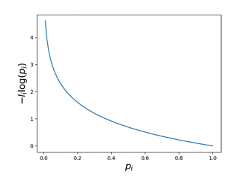
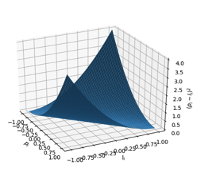
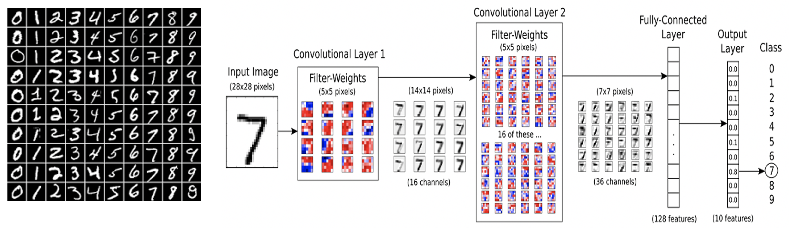
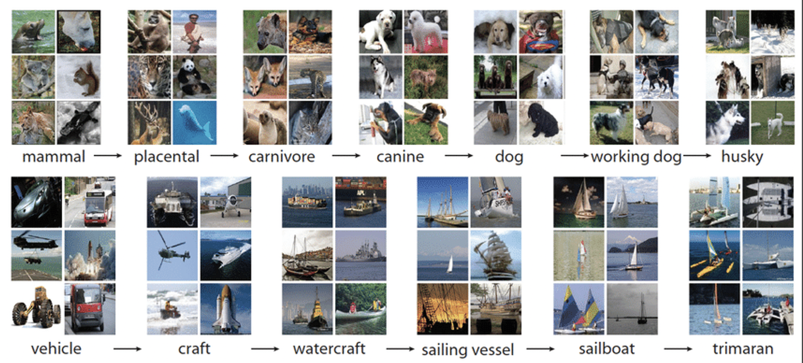

# 9. Deep Learning and Image Processing

[TOC]

---

## 9.1 Supervised ML

- Motivation:
  - Images are projections of the real world
  - We want to extract **semantic** information from these images that tell use something about its setting
  - Analytically coming up with mathematical model that describe real world elements is difficult. 
  - **Machine learning** presents flexible models with parameters that can be shaped to recognize different tasks.

### Supervised machine learning

- We want to solve some problem that involves transforming 
  - (**X** [input data] → **Y** [labels])
  - Ex X: Images, Videos, any real data
  - Ex Y: Discrete classes - {'cat', 'dog'}, Regression - $\mathbb{R}$
- **Idea:** Implement an algorithm called a **Model.**
  - **Model** transforms **X** → **P** [prediction] ≈ **Y** based on a sample of data. 
- 

### Statistics of Supervised learning

- For any problem, we can consider all possible pairs of **X** and **Y** as instances of a **population.**

- In supervised learning, we are given a **sample** of (**X,Y)** called a **training set**.

- Goal: Tune a **model** based on the **training set** to make predictions on unseen examples from the **population (**called the **testing set).**

  

  

| General Process                                              |
| ------------------------------------------------------------ |
|  |
|  |
|  |

---

## 9.2 Neural Networks - Feedforward

- Idea:
  - What we want from a supervised learning model:
    - Can fit to any unknown relationships
    - Behaviour controlled by parameters
    - Parameters that can be tuned from the Training Set.
  - Neural networks fit this criteria
  
- **Neural Networks:**
  - Composed of **hidden layers**
  - Non-linear functions applied to linear combinations of previous layer(s)
  - The **network** connects several hidden layers together to produce a prediction.
  
- **Multilayer Perceptron** Formulation:
  - For **Layer**  $t$:
    - **Parameters:**
      - $W^t \in \mathbb{R}^{m\times n}, \,b^t \in \mathbb{R}^m$
    - **Hidden Layers:**
      - $h^t \in \mathbb{R}^m, \, h^{t-1} \in \mathbb{R}^n$
    - **Hidden Layer Formula:**
      - $h_i^t = f(\underset{j}{\sum} W^t_{i,j} h^{t-1}_j + b_i^t)$
      - $h^t = f(W^th^{t-1} + b^t)$

- **MLP Example:**

  | MLP Example =>                                               |                                                              |
  | ------------------------------------------------------------ | ------------------------------------------------------------ |
  |  - 2 hidden layer - W: weight matrix, b: bias vector |  |
  |  |                                                              |

  

- Non-linear Function

  - classical hidden layer function: **tanh** function [-1,1]
  - binary classification: **sigmoid** function [0,1]
  - popular in CV: **relu** function [0, $\infin$]
  - **Softmax function**: normalize to 1 => good for probability 
  - ==IMPOTRANT: they must be **differentiable**==
  
  

---

## 9.3 Neural Networks - Training

### Training

- Training typically done with ==**stochastic gradient descent**==.

  - Loss function: L(p, y) →discrepancy between **p** and **y**.

  - Adjust parameters using the examples in training set

    - $\theta \leftarrow \theta - \alpha \frac{\part L}{\part \theta}$

      

- **Discrete Classification:**

  - $L = \sum -l_i\, \log{p_i}$

  - ==**Cross Entropy**==

    

- **Regression Tasks:**

  - $L = \frac{1}{N}(l_i - p_i)^2$

  - **Mean Squared Error:**

    

### Backpropagation

- Evaluation – forward propagation. 

- Gradient descent: update parameters by steps to reduce loss. $θ←θ-α \frac{∂L}{∂θ}$

- How do we compute derivatives for each parameter?

  - Applying **chain rule** in a smart manner. 

    $\frac{∂L(f(t))}{∂t}=\frac{∂L}{∂f} \frac{∂f}{∂t}$

  - Start at end, move to start.

- Training – **back propagation**:

### Layers to x Properties Table

| Loss to prediction                                           | Layer to weight                                              | Layer to Bias                                                | Layer to Layer                                               |
| ------------------------------------------------------------ | ------------------------------------------------------------ | ------------------------------------------------------------ | ------------------------------------------------------------ |
| Compute $\frac{\part L}{\part p_i}$ Ex: $\begin{align}L &= \sum{-l_j \log{p_j}} \\ \frac{\part L}{\part p_i} &= \frac{-l_i}{p_i} \end{align}$  $\begin{align}L &= \frac{1}{N}\sum{(l_i - p_i)^2} \\ \frac{\part L}{\part p_i} &= \frac{2}{n}(p_i-l_i) \end{align}$ | $\begin{align}& p_i = f(\sum_j {W^3_{i,j}h^2_j + b_i^3}) \\ & \frac{\part L}{\part W^3_{i,j}}=\frac{\part L}{\part p_i}\frac{\part p_i}{\part W^3_{i,j}}\end{align}$  ==Note: assumes that $p_i$, $p_j$ are independent.==  Slightly different for softmax:  $\begin{align} \frac{\part L}{\part W^3_{i,j}}=\sum_k \frac{\part L}{\part p_k}\frac{\part p_k}{\part W^3_{i,j}}\end{align}$  | $\begin{align}& p_i = f(\sum_j {W^3_{i,j}h^2_j + b_i^3}) \\ & \frac{\part L}{\part b^3_{i}}=\frac{\part L}{\part p_i}\frac{\part p_i}{\part b^3_{i}}\end{align}$  If not dependent: $\begin{align} \frac{\part L}{\part b^3_{i}}=\sum_k \frac{\part L}{\part p_k}\frac{\part p_k}{\part b^3_{i}}\end{align}$  | $\begin{align}& p_i = f(\sum_j {W^3_{i,j}h^2_j + b_i^3}) \\ & \frac{\part L}{\part h^2_{i}}=\sum_i\frac{\part L}{\part p_i}\frac{\part p_i}{\part h^2_{i}}\end{align}$  |
|          |  |  |  |

### Stochastic Gradient Descent

- Divides training set into “mini-batches”
  - Computes average update $\theta \leftarrow \theta-\alpha \frac{\part L}{\part\theta}$ for each mini-batch
  - More robust than updating for each sample, or over all samples.
- An “epoch” is when all mini-batches are processed in the training set.
- Networks will train over many epochs until error reaches an appropriate level.

### Training Cycle Table

| Training Cycle                                               |
| ------------------------------------------------------------ |
|  |
|  |
|  |
|  |
|  |

### Universal Approximation Theorem

- A neural network with the right number of nodes and proper parameters can approximate (almost) any real function.
- Other types of models rely on feature engineering to perform complex tasks
  - Support vector machines, Random forest, and Logistic regression.
  - Neural networks relax this requirement

### Challenges

1. Underfitting

   - Model doesn’t have enough capacity to learn X → Y relationship.

     

2. Overfitting

   - Model has fit too rigidly to the biases in the training set.

   - Indicator: Prediction accuracy on training set is **very** different than accuracy on testing set.

     

     

   - **Strategies to combat Overfitting**:

     - Less Parameters

     - Get more data

     - Other Techniques:

       - Regularization
       - Dropout – randomly disable nodes during training
       - Data augmentation

       

---

## 9.4 Convolutional Neural Networks

### Applying MLP to images:

- High parameterization

- In natural images, adjacent pixels are spatially correlated.

  - Fully connected hidden layers do not exploit this property.

  

### Convolutional neural network

​	- https://medium.com/datadriveninvestor/convolution-neural-networks-vs-fully-connected-neural-networks-8171a6e86f15

- Composed of **convolutional layers**

  - Replaces fully connected matrix multiplication with convolution (actually correlation).

    

- **Layers**

  - $H^t \in \mathbb{R}^{X\times Y\times c}$, $H^{t-1} \in \mathbb{R}^{A\times B \times d}$

- **Parameters**

  - $W^t \in \mathbb{R}^{m\times n\times c\times d}, \, b^t \in \mathbb{R}^c$
  - $m,n \ll X,Y$
  - A total of $c \times d$ conv. filters that to interact between the channels of each layer

- **Formula:**

  - $H^t_{:,:,i} = f(\sum_j(H^t_{:,:,i}* W^t_{:,:,i,j})+b^t_i)$

  

### Convolutional Layer

### Training CNN - Layer Table

| Layer to Layer                                               | Layer to Weight                                              | Other Layers                                                 |
| ------------------------------------------------------------ | ------------------------------------------------------------ | ------------------------------------------------------------ |
| $\frac{\part L}{\part H^{t-1}_{a,b,j}}=\sum_x \sum_y \frac{\part L}{\part H^t_{x,y,i}} \frac{\part H^t_{x,y,i}}{\part H^{t-1}_{a,b,j}}$ | $\frac{\part L}{\part W^{t}_{a-x,b-y,i,j}}=\sum_x \sum_y \frac{\part L}{\part H^t_{x,y,i}} \frac{\part H^t_{x,y,i}}{\part W^{t}_{a-x,b-y,i,j}}$ | - It is useful to reduce spatial dimension. - Analyze image features at different scales - Can be accomplished through **striding** |
|  |  |  |

### Example CNN Architecture

### Applications Table

| Application & Details                                        | Image                                                        |
| ------------------------------------------------------------ | ------------------------------------------------------------ |
| ** MNIST** - A large database of handwritten digits - Used for training and testing different Machine Learning models |  |
| **ImageNet** - a large dataset of annotated photographs intended for computer vision research - around 14 million images - 21 thousand groups - 1 million images that have bounding box annotations |  |
| **ImageNet - General Tasks** - **Image Classification**: Predict the classes of objects present in an image - **Single-object Localization**:  Image classification + draw bounding box around one example of each object present - **Object Detection**: Image classification + draw a bounding box aoround each object present |  |
| **Microsoft COCO** - 330 000 images - Segmentation, object recognition, key points ... |  |

### Buzzword List:

- Fully convolutional networks
- Recurrent neural networks
- Batch normalization
- Dropout
- Residual blocks
- Generative Adversarial networks
- Training algorithms: RMSProp, ADAM, Adagrad

### Further Reading:

Neural Networks and Deep Learning by Michael Nielsen

Pattern Recognition and Machine Learning by C. Bishop

A guide on convolutional arithmetic for deep learning by V. Dumoulin and F. Visin